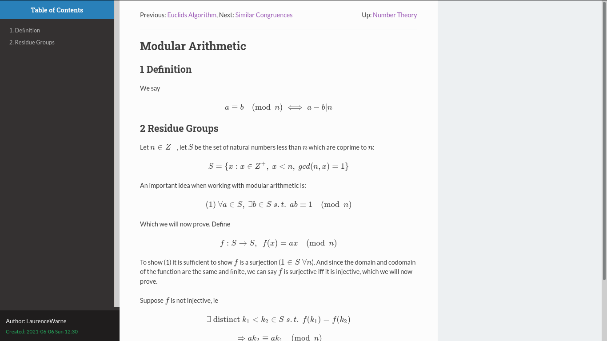

# Yet Another Org Wiki

ox-yaow - yet another org wiki, is a lightweight as-is org to html export option. It doesn't require any modifications to existing org files, and instead uses the directory structure of the source files to generate links between pages.

It's main use case is static site generation, perfect for publishing notes, etc to Jekyll. You can see an example [here](https://laurencewarne.github.io/wiki/wiki.html), which were generated from the org files located [here](https://github.com/LaurenceWarne/org-files).

ox-yaow will generate hyperlinks at the top of html files between files in the same directory (in a similar manner to pages in the [Emacs Manual](https://www.gnu.org/software/emacs/manual/html_node/emacs/index.html)), in addition to creating *indexing files* per directory which list the pages sourced from that directory (an equivalent example would be the [Modes](https://www.gnu.org/software/emacs/manual/html_node/emacs/Modes.html#Modes) page in the Emacs manual).

Here is an example page (assets stolen from the brilliant [org html themes](https://github.com/fniessen/org-html-themes)).



## Installation + Usage

You can use  to install the package.

In order to use the package we will need to add a new project to ```org-publish-project-alist``` or edit an existing one:

```lisp
(use-package ox-yaow
  :ensure nil
  :quelpa (ox-yaow :fetcher github :repo "laurencewarne/ox-yaow.el" :upgrade t)
  :config
  ;; Stolen from https://github.com/fniessen/org-html-themes
  (setq rto-css '("https://fniessen.github.io/org-html-themes/src/readtheorg_theme/css/htmlize.css"
                  "https://fniessen.github.io/org-html-themes/src/readtheorg_theme/css/readtheorg.css")
        rto-js '("https://fniessen.github.io/org-html-themes/src/lib/js/jquery.stickytableheaders.min.js"
                 "https://fniessen.github.io/org-html-themes/src/readtheorg_theme/js/readtheorg.js")
        extra-js '("https://ajax.googleapis.com/ajax/libs/jquery/2.1.3/jquery.min.js"
                   "https://maxcdn.bootstrapcdn.com/bootstrap/3.3.4/js/bootstrap.min.js" )
        ox-yaow-html-head (concat (mapconcat (lambda (url) (concat "<link rel=\"stylesheet\" type=\"text/css\" href=\"" url "\"/>\n")) rto-css "")
                                  (mapconcat (lambda (url) (concat "<script src=\"" url "\"></script>\n")) (append rto-js extra-js) ""))
        org-publish-project-alist (cons
                                   `("wiki"
                                     ;;-------------------------------
                                     ;; Standard org publish options
                                     ;;-------------------------------
                                     :base-directory "~/org/"
                                     :base-extension "org"
                                     :publishing-directory "~/wiki/"
                                     :html-head ,ox-yaow-html-head
                                     :html-preamble t
                                     :recursive t
                                     :publishing-function ox-yaow-publish-to-html
                                     ;; Auto generates indexing files
                                     :preparation-function ox-yaow-preparation-fn
                                     ;; Removes auto-generated files
                                     :completion-function ox-yaow-completion-fn
                                     ;;------------------------------
                                     ;; Options specific to ox-yaow
                                     ;;------------------------------
                                     :ox-yaow-depth 1)
                                   org-publish-project-alist)))
```

With this set up we are good to go. The standard org publish workflow can be used now: ```C-c C-e``` (```org-export-dispatch```) from within any org file in the project and select ```P``` to export our project, and then choose `wiki`.

In order to get code syntax highlighting on your html pages, you might want to install [htmlize](https://github.com/hniksic/emacs-htmlize).

## Configuration

In most cases it will be necessary to impose some kind of custom ordering to your note files. For example, by default directories and files are all sorted alphabetically which may be problem when your ```Functions``` page precedes your ```Introduction to Elisp``` page. Additionally you may want to add extra information to your indexing pages.

ox-yaow solves this by allowing you to generate an indexing file for a directory by calling ```ox-yaow-generate-indexing-file``` from within any org file in the current directory. When you next export, ox-yaow will then respect any ordering suggested by the second level headers.

For example, suppose the following is generated by a call to ```ox-yaow-generate-indexing-file```:

```
#+TITLE: Elisp
* Elisp
** [[./control-structures.html][Control Structures]]
** [[./functions.html][Functions]]
** [[./introduction.html][Introduction]]
** [[./variables.html][Variables]]
```

Editing the file to (`avy-transpose-lines-in-region` is helpful here):

```
#+TITLE: Elisp
* Elisp
** [[./introduction.html][Introduction]]
** [[./variables.html][Variables]]
** [[./control-structures.html][Control Structures]]
** [[./functions.html][Functions]]
```

Will give us the intended ordering on the next export.

## Similar Packages

### [org-brain](https://github.com/Kungsgeten/org-brain)

Also see [org-brain-export](https://github.com/Kungsgeten/org-brain-export).

### [org-wiki](https://github.com/caiorss/org-wiki)

### [org2jekyll](https://github.com/ardumont/org2jekyll)
